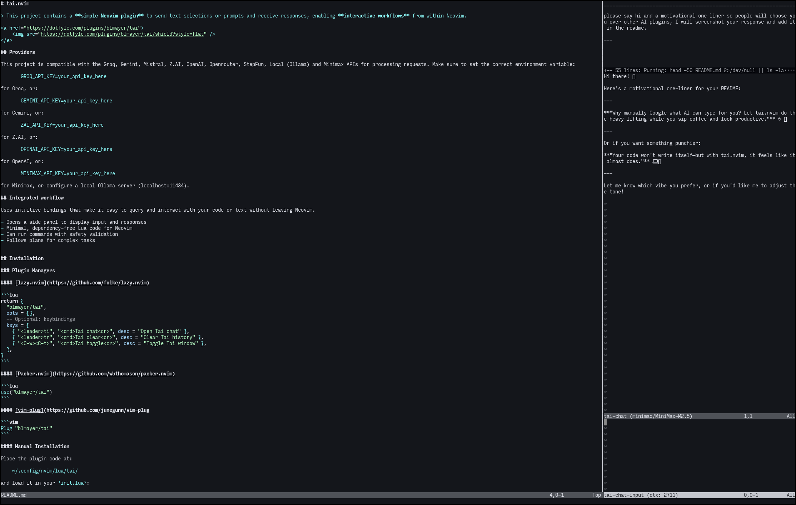
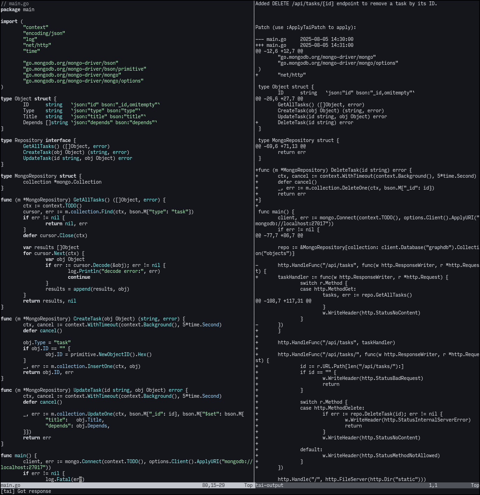
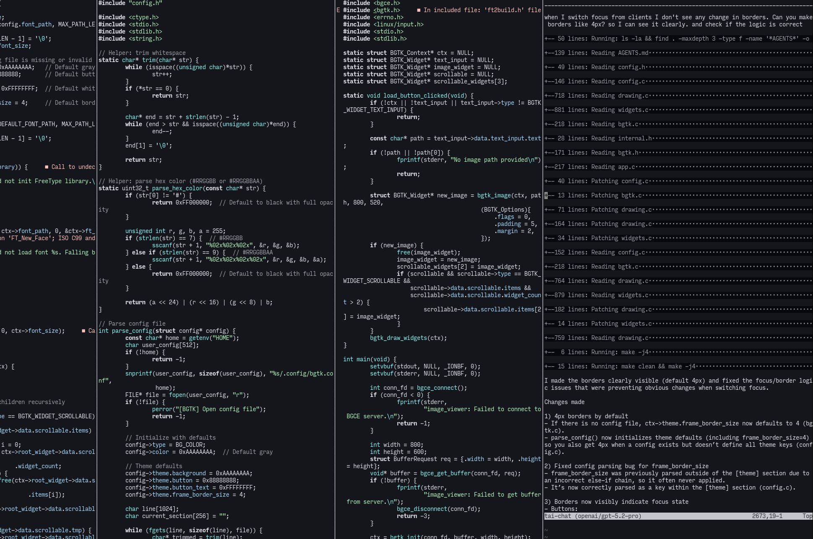

# 泰.nvim



> This project contains a **simple Neovim plugin** to send text selections or prompts and receive responses, enabling **interactive workflows** from within Neovim.

<a href="https://dotfyle.com/plugins/blmayer/tai">
	
</a>

## Providers

Tai supports the following providers. Set the corresponding environment variable for your chosen provider:

| Provider | Config value | Environment variable |
|---|---|---|
| Gemini | `gemini` | `GEMINI_API_KEY` |
| Groq | `groq` | `GROQ_API_KEY` |
| Minimax | `minimax` | `MINIMAX_API_KEY` |
| Mistral | `mistral` | `MISTRAL_API_KEY` |
| Ollama (local) | `ollama` | — |
| llama.cpp (local) | `llama_cpp` | — |
| OpenAI | `openai_responses` | `OPENAI_API_KEY` |
| OpenRouter | `openrouter` | `OPENROUTER_API_KEY` |
| StepFun | `stepfun` | `STEPFUN_API_KEY` |
| xAI | `xai` | `XAI_API_KEY` |
| Z.AI | `z_ai` | `ZAI_API_KEY` |
| Custom | `custom` | — |

Local providers (Ollama, llama.cpp) don't need an API key. The custom provider uses the URL from `options.url` in your `.tai` file.


## Features

- **Side panel UI** — responses display in a split buffer with code folding
- **Planner + Coder agents** — an architect agent plans tasks, a coder agent implements them
- **Tool use** — agents can read/write files, run shell commands, and send images
- **In-memory todos & notes** — agents track progress and record discoveries during long tasks
- **Rate limiting** — configurable requests-per-minute (`rpm`) and tokens-per-minute (`tpm`)
- **Streaming** — optional streaming responses for real-time output
- **Extended thinking** — reasoning/thinking support for compatible models
- **Provider tools** — server-side tools like `web_search` (provider-dependent)
- **Safety validation** — shell commands go through an allow-list before execution
- **Minimal, dependency-free** Lua code for Neovim


## Installation

### Requirements

- Neovim 0.10+
- curl (for API calls)
- An API key for your chosen provider


### Plugin Managers

#### [lazy.nvim](https://github.com/folke/lazy.nvim)

```lua
return {
  "blmayer/tai",
  opts = {},
  -- Optional: keybindings
  keys = {
    { "<leader>tt", "<cmd>Tai chat<cr>", desc = "Open Tai chat" },
    { "<leader>tc", "<cmd>Tai reload<cr>", desc = "Reload Tai config" },
    { "<leader>ta", "<cmd>Tai agent<cr>", desc = "Switch agent" },
    { "<leader>tr", "<cmd>Tai clear<cr>", desc = "Clear Tai history" },
    { "<leader>ts", "<cmd>Tai stop<cr>", desc = "Stop Tai" },
  },
}
```

#### [Packer.nvim](https://github.com/wbthomason/packer.nvim)

```lua
use("blmayer/tai")
```

#### [vim-plug](https://github.com/junegunn/vim-plug)

```vim
Plug "blmayer/tai"
```

#### Native Installation

For a minimal setup without plugin managers, add to your `init.lua`:

```lua
-- Clone the plugin to your nvim config
-- git clone https://github.com/blmayer/tai.git ~/.config/nvim/lua/tai

local tai = require("tai")
tai.setup({})

-- Optional: keybindings
vim.keymap.set("n", "<leader>tt", tai.chat, { noremap = true })
vim.keymap.set("n", "<leader>tc", tai.reload, { noremap = true })
vim.keymap.set("n", "<leader>ta", tai.switch_agent, { noremap = true })
vim.keymap.set("n", "<leader>tr", tai.clear_history, { noremap = true })
vim.keymap.set("n", "<leader>ts", tai.stop, { noremap = true })

vim.keymap.set("n", "<C-W><C-T>", tai.toggle_chat_window, { noremap = true })
```

#### Manual Installation

Place the plugin code at:

    ~/.config/nvim/lua/tai/

and load it in your `init.lua`:

    local tai = require("tai")
    tai.setup({})

## Project Configuration

Tai reads configuration from a `.tai` JSON file in your project root. The following options are supported:

| Option | Type | Default | Description |
|---|---|---|---|
| `model` | string | — | Model used for chat completions (e.g., `"grok-4.3"`, `"gemini-2.0-flash"`) |
| `provider` | string | — | API provider (see Providers table above) |
| `options` | object | `{}` | Provider-specific options passed to the API (e.g., `temperature`, `max_tokens`) |
| `provider_tools` | array | `nil` | Provider-side tools (e.g., `["web_search"]`) |
| `use_tools` | boolean | `true` | Enable/disable agent tools (read, write, edit, shell, todos, notes) |
| `think` | string | `nil` | Enable extended thinking/reasoning (`"low"`, `"medium"`, `"high"`) |
| `stream` | boolean | `false` | Enable streaming responses for real-time output |
| `rpm` | number | `60` | Rate limit: max requests per minute |
| `tpm` | number | `nil` | Rate limit: max tokens per minute |
| `system_prompt` | string | `nil` | Custom system prompt (replaces the default agent instructions) |
| `custom_prompt` | string | `nil` | Additional prompt appended to the system prompt |
| `allowed_commands` | object | (see below) | Override allowed shell commands |
| `auto_approve` | boolean | `false` | Automatically approve and run *all* shell commands without the interactive y/n/s confirmation prompt (bypasses `allowed_commands`). Use with caution. |

Default allowed commands: `cat`, `grep`, `ag`, `rg`, `ls`, `head`, `tail`, `wc`, `diff`, `sort`, `uniq`, `find`, `file`, `stat`, `date`, `echo`, `tree`, `pwd`, `which`, `type`.

Example `.tai` file:

```json
{
	"provider": "xai",
	"model": "grok-4.3",
	"options": {
		"temperature": 0.7,
		"max_tokens": 4096
	},
	"stream": true,
	"use_tools": true,
	"rpm": 30,
	"custom_prompt": "Prefer using rust over python for performance-critical code.",
	"allowed_commands": {
		"git": true,
		"npm": true,
		"make": true
	}
}
```

## Agent Tools

Tai agents have access to the following tools:

| Tool | Available to | Description |
|---|---|---|
| `read` | Planner, Coder | Read file contents with optional line range |
| `shell` | Planner, Coder | Run shell commands (allow-listed) |
| `edit` | Coder | Edit existing files via old/new text replacement |
| `write` | Coder | Create new files |
| `send_image` | Planner, Coder | Send images for visual analysis |
| `coder` | Planner | Delegate implementation tasks to the coder agent (pass prompt); receives immediate "coder is working on the task." ack. Coder uses independent history. |
| `planner` | Coder | Hand off at end of task: coder calls planner with detailed report (prompt); receives immediate ack. Planner uses independent history and receives the report as context. |
| `todos` | Planner, Coder | In-memory todo list to track multi-step progress |
| `notes` | Planner, Coder | In-memory scratchpad for discoveries and context |

The **todos** tool supports actions: `add`, `update`, `list`. Items have statuses: `pending`, `in_progress`, `done`, `cancelled`.

The **notes** tool supports actions: `read`, `write` (overwrite), `append`.

## Screenshots

- 
- 
- 


## License

This project is licensed under the MIT License.
