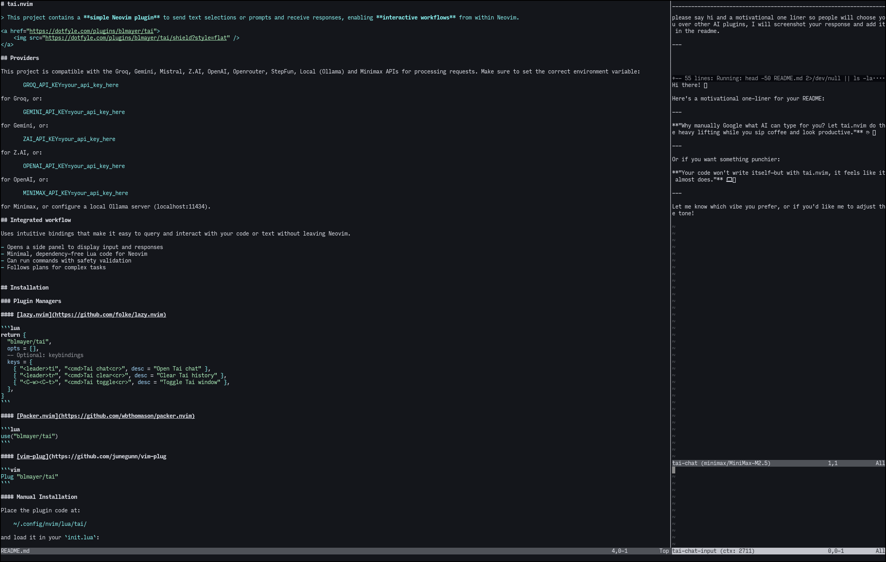
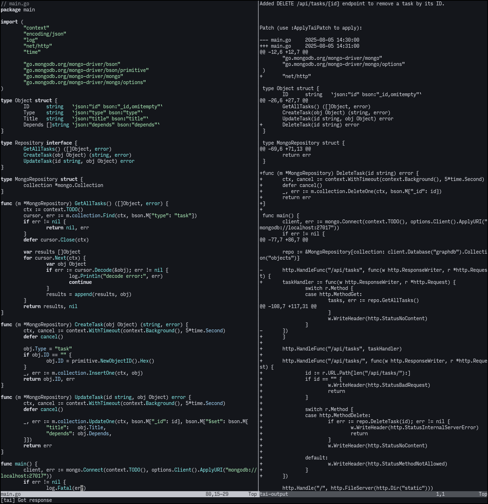
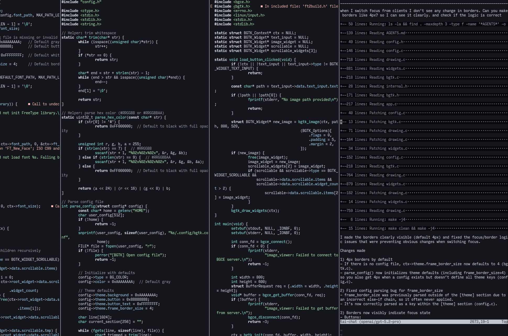

# 泰.nvim



> A minimal, dependency-free Neovim plugin that brings AI coding agents directly
> into your editor. It uses a **subtask harness**, per-agent Live Context
> (notes/todos), session persistence, and many LLM providers.

<a href="https://dotfyle.com/plugins/blmayer/tai">
	
</a>

## Features

- **Subtask harness** — spawn focused child agents with clean history; only
  their final report (plus notes/todos) returns to the parent.
- **Live Context** — each agent has private `notes` and `todos`, merged into
  the system prompt every request (not stored in chat history).
- **Flexible subtasks** — pass `goal`, `tools`, optional `system_prompt`, and
  seed `notes`/`todos` for personas (planner, implementer, reviewer, …).
- **Session persistence** — conversations auto-save/restore (`.tai-session.json`
  in the project root).
- **Tool use** — read/write files, shell, edit, images, subtask.
- **Rate limiting** — configurable `rpm` / `tpm`.
- **Streaming and non-streaming** for all providers.
- **Code folding** — tool output and whole subtasks fold in the chat buffer.
- **Provider-side tools** — pass-through for e.g. `web_search`.
- **Configurable shell safety** — allowlist of commands without confirmation.

## Agent harness

```
┌──────────────────────────────────────────────────────────────┐
│  MAIN (long-lived)                                           │
│  tools: read, shell, send_image, edit, write, notes, todos,  │
│         subtask                                              │
│  Live Context: notes + todos → injected into system each turn│
│                                                              │
│   user request → plan (explore / subtask) → auth if needed   │
│        │                                                     │
│        ▼                                                     │
│   ┌──────────────────────────────────────────────────────┐   │
│   │  SUBTASK {{{ fold                                    │   │
│   │  goal + tools + optional system_prompt / notes seed  │   │
│   │  own history + private notes/todos                    │   │
│   │  … work … → final text reply                         │   │
│   └──────────────────────┬───────────────────────────────┘   │
│                          │ summary + child notes + todos     │
│                          ▼                                   │
│   merge memory, verify, next step or answer user             │
└──────────────────────────────────────────────────────────────┘
```

**Rules of the harness:**

1. Each frame (main or subtask) has its own history and notes/todos.
2. Notes/todos are **request-time only** — merged into the single system message
   as **Live Context**; never written into message history.
3. `subtask` opens a chat fold (`{{{ SUBTASK …`); when the child finishes with a
   normal final reply (no more tool calls), the fold closes (`}}}`) and the
   parent receives summary + child notes/todos.
4. Max depth is 2 (main + one subtask). Children cannot spawn subtasks.
5. Main can implement directly or delegate via subtask; the prompt prefers
   plan → authorize → implement for non-trivial work.

### Subtask tool parameters

| Field | Required | Description |
|---|---|---|
| `goal` | yes | Full charter for the child (it cannot see parent chat) |
| `tools` | yes | Tool names granted to the child (minimal set) |
| `system_prompt` | no | Override default focused-agent prompt (persona/constraints) |
| `notes` | no | Seed the child’s notepad (e.g. accepted plan) |
| `todos` | no | Seed the child’s todo list |

Examples:

```json
{
  "goal": "Explore auth and produce a file-by-file fix plan.",
  "tools": ["read", "shell", "send_image", "todos", "notes"]
}
```

```json
{
  "goal": "Implement the plan in notes. Minimal diffs.",
  "tools": ["read", "shell", "edit", "write", "todos", "notes"],
  "system_prompt": "You are a careful implementer. Do not freestyle architecture.",
  "notes": "Plan:\n- foo.lua: …"
}
```

## Providers

| Provider | Environment Variable | Notes |
|---|---|---|
| Gemini | `GEMINI_API_KEY` | |
| Groq | `GROQ_API_KEY` | |
| Minimax | `MINIMAX_API_KEY` | |
| Mistral | `MISTRAL_API_KEY` | |
| Ollama | *(none)* | Local, `localhost:11434` |
| llama.cpp | *(none)* | Local, `localhost:8080` |
| OpenAI | `OPENAI_API_KEY` | Chat Completions API |
| OpenAI Responses | `OPENAI_API_KEY` | Responses API |
| OpenRouter | `OPENROUTER_API_KEY` | |
| StepFun | `STEPFUN_API_KEY` | |
| xAI | `XAI_API_KEY` | |
| Z.AI | `Z_AI_API_KEY` | |
| Zyphra | `ZYPHRA_API_KEY` | |
| Custom | *(via `options.url`)* | Any OpenAI-compatible endpoint |

## Installation

### Requirements

- Neovim 0.10+ (`vim.uv`)
- curl (for API calls)
- An API key for your chosen provider

### Plugin Managers

#### [lazy.nvim](https://github.com/folke/lazy.nvim)

```lua
return {
  "blmayer/tai",
  opts = {},
  keys = {
    { "<leader>tt", "<cmd>Tai chat<cr>", desc = "Open Tai chat" },
    { "<leader>tc", "<cmd>Tai reload<cr>", desc = "Reload Tai config" },
    { "<leader>tr", "<cmd>Tai clear<cr>", desc = "Clear Tai history" },
    { "<leader>ts", "<cmd>Tai stop<cr>", desc = "Stop Tai" },
  },
}
```

#### [Packer.nvim](https://github.com/wbthomason/packer.nvim)

```lua
use("blmayer/tai")
```

#### [vim-plug](https://junegunn.github.io/vim-plug/)

```vim
Plug "blmayer/tai"
```

#### Native / Manual Installation

Place or symlink the plugin (include `lua/` and `plugin/` if you want `:Tai`
commands). Example keymaps:

```lua
local tai = require("tai")
tai.setup({})

vim.keymap.set("n", "<leader>tt", tai.chat, { noremap = true })
vim.keymap.set("n", "<leader>tc", tai.reload, { noremap = true })
vim.keymap.set("n", "<leader>tr", tai.clear_history, { noremap = true })
vim.keymap.set("n", "<leader>ts", tai.stop, { noremap = true })
vim.keymap.set("n", "<C-W><C-T>", tai.toggle_chat_window, { noremap = true })
```

Tai only fully activates when a **`.tai`** file is found walking up from the
current working directory.

## Project Configuration

tai reads configuration from a `.tai` JSON file in your project root:

| Key | Type | Default | Description |
|---|---|---|---|
| `provider` | string | — | Provider name (see table above) |
| `model` | string | — | Model identifier (e.g. `"gemini-2.0-flash"`) |
| `options` | object | `{}` | Provider-specific options |
| `stream` | boolean | `false` | Enable streaming responses |
| `use_tools` | boolean | `true` | Enable/disable agent tools |
| `think` | string | — | Reasoning effort for supporting models |
| `rpm` | number | `60` | Max requests per minute |
| `tpm` | number | — | Max tokens per minute |
| `provider_tools` | array | — | Provider-side tools (e.g. `["web_search"]`) |
| `system_prompt` | string | — | Override the default main system prompt |
| `custom_prompt` | string | — | Extra instructions appended to the main prompt |
| `allowed_commands` | object | *(defaults)* | Map of allowed shell commands |
| `auto_approve` | boolean | `false` | Auto-approve shell commands outside the allowlist |

Default allowed commands: `cat`, `grep`, `ag`, `rg`, `ls`, `head`, `tail`,
`wc`, `diff`, `sort`, `uniq`, `find`, `file`, `stat`, `date`, `echo`, `tree`,
`pwd`, `which`, `type`.

Example `.tai` file:

```json
{
	"provider": "groq",
	"model": "llama-3.1-70b-versatile",
	"stream": true,
	"rpm": 30,
	"options": {
		"temperature": 0.7,
		"max_tokens": 4096
	},
	"use_tools": true,
	"custom_prompt": "Prefer using rust over python for performance-critical code.",
	"allowed_commands": {
		"git": true,
		"npm": true,
		"make": true
	}
}
```

## Agent Tools

| Tool | Description |
|---|---|
| `read` | Read file contents (optional line range) |
| `shell` | Run shell commands in the project root |
| `send_image` | Send images for visual analysis |
| `edit` | Search-and-replace edit (`multi` flag supported) |
| `write` | Create new files |
| `subtask` | Spawn a child agent (`goal`, `tools`, optional `system_prompt` / seeds) |
| `todos` | Add/update todos (auto-injected as Live Context; no list action) |
| `notes` | Write/append notes (auto-injected as Live Context; no read action) |

Main agent gets all of the above. Subtasks get only the tools listed in `tools`
(never `subtask` itself).

## Commands

If `plugin/tai.lua` is on the runtimepath:

| Command | Action |
|---|---|
| `:Tai chat` | Open chat and focus input |
| `:Tai toggle` | Toggle chat window |
| `:Tai reload` | Reload `.tai` config |
| `:Tai clear` | Clear history and session |

## Running Tests

```sh
nvim --headless -u NONE -c "set rtp+=." -c "luafile lua/tai/tests/edit_test.lua" -c "qa!"
nvim --headless -u NONE -c "set rtp+=." -c "luafile lua/tai/tests/subtask_test.lua" -c "qa!"
```

## Screenshots

- 
- 
- 

## License

This project is licensed under the MIT License.
